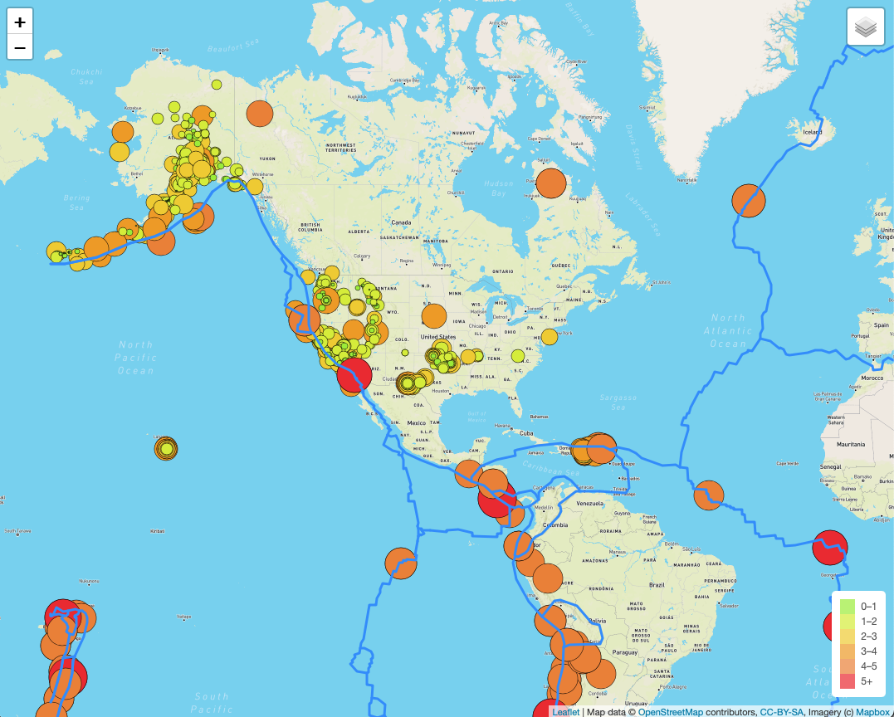
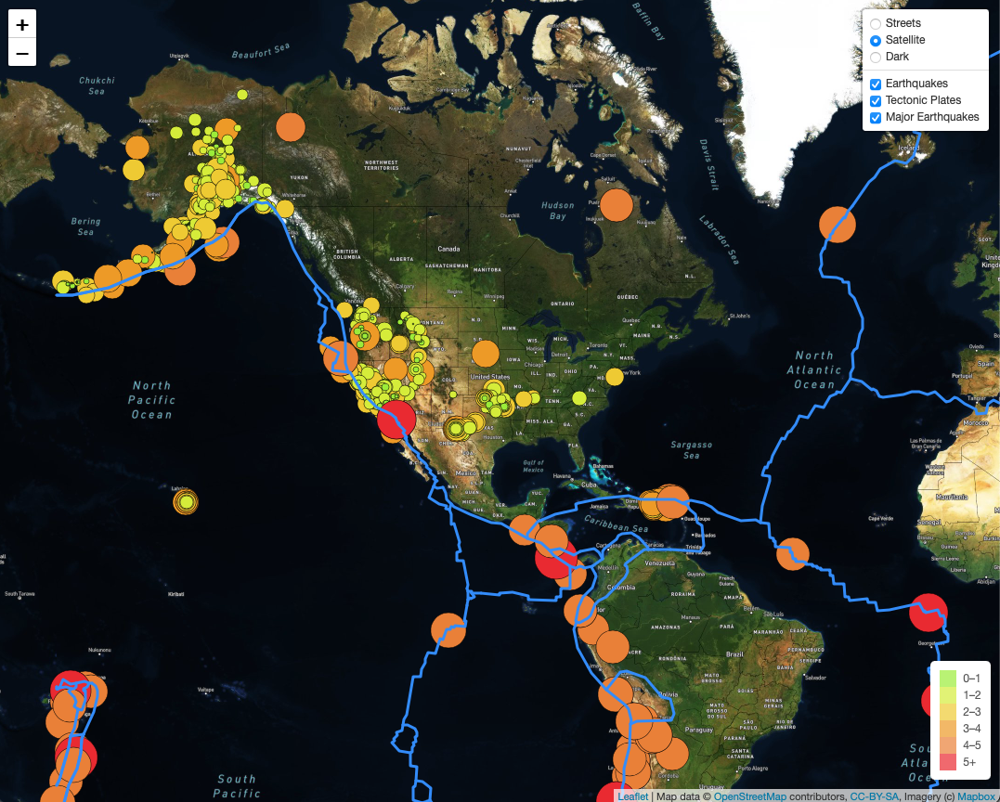
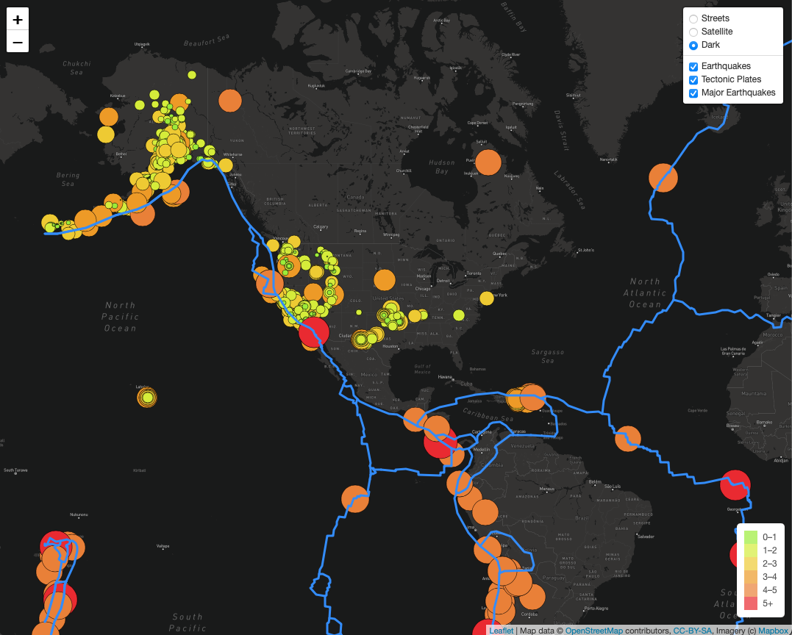
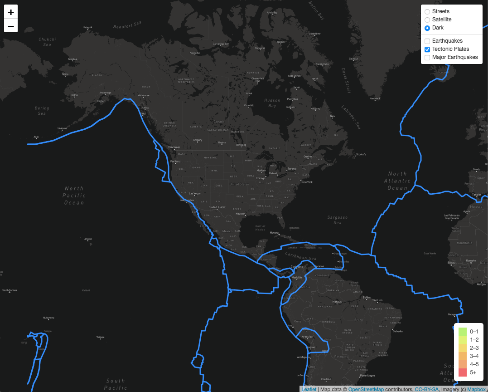
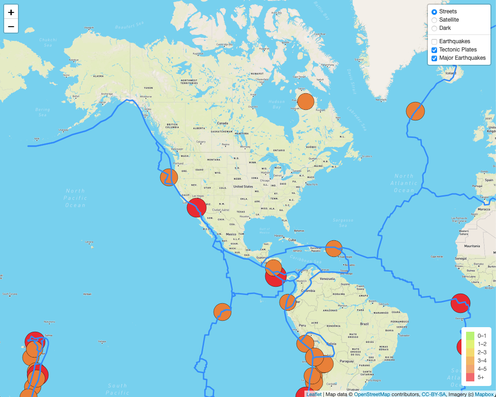

# Mapping_Earthquakes

## Overview
In this project I used d3.js to plot geoJSON data.
I used an api to configure a map onto a webpage.
I used JavaScript functions create markers on the map and style them in accordance to earthquakes magnitudes.

## Summary
This project was pretty cool to see an interactive map come to life. It's amazing how we can bring JSON data to an interactive interface to visualize it.

## Technologies Used
- Github
- Google
- VS Code
- Zsh Terminal
- D3.js
- Mapbox API
- JSON
- geoJSON
- JavaScript
- HTML
- CSS